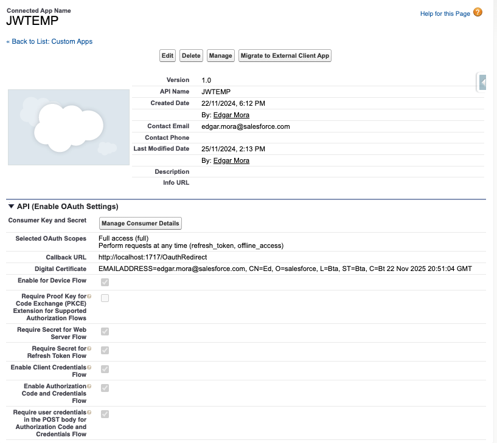
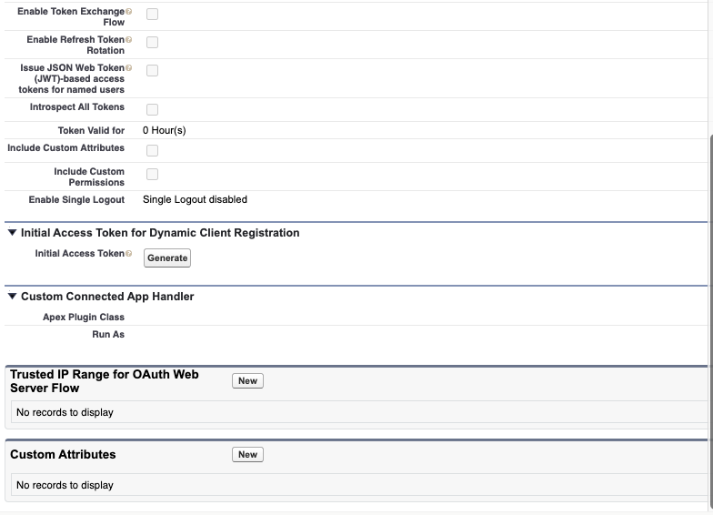

# Salesforce DX Project: Next Steps

Now that you’ve created a Salesforce DX project, what’s next? Here are some documentation resources to get you started.

## How Do You Plan to Deploy Your Changes?

Do you want to deploy a set of changes, or create a self-contained application? Choose a [development model](https://developer.salesforce.com/tools/vscode/en/user-guide/development-models).

## Configure Your Salesforce DX Project

The `sfdx-project.json` file contains useful configuration information for your project. See [Salesforce DX Project Configuration](https://developer.salesforce.com/docs/atlas.en-us.sfdx_dev.meta/sfdx_dev/sfdx_dev_ws_config.htm) in the _Salesforce DX Developer Guide_ for details about this file.

## Read All About It

- [Salesforce Extensions Documentation](https://developer.salesforce.com/tools/vscode/)
- [Salesforce CLI Setup Guide](https://developer.salesforce.com/docs/atlas.en-us.sfdx_setup.meta/sfdx_setup/sfdx_setup_intro.htm)
- [Salesforce DX Developer Guide](https://developer.salesforce.com/docs/atlas.en-us.sfdx_dev.meta/sfdx_dev/sfdx_dev_intro.htm)
- [Salesforce CLI Command Reference](https://developer.salesforce.com/docs/atlas.en-us.sfdx_cli_reference.meta/sfdx_cli_reference/cli_reference.htm)

## Para implementsar CICD seguir estos manuales
https://github.com/amitastreait/github-actions/?tab=readme-ov-file#integrate-the-static-code-analysis-tool

## Comando Test de JWT-Based Flow

 ### Comando de Documentación
 sf org login jwt --username  edgar@clarosfi.com.co.devops --jwt-key-file /Users/edgar.mora/Downloads/server.key --client-id {ADD_YOUR_CLIENT_ID} --instance-url https://test.salesforce.com --json
 ### Comando con Valores Test "Favor ajustarlos de acuerdo con valores de Aplicación conectada y Key generada
sf org login jwt --username  edgar.mora@CRM.com.co.devops --jwt-key-file /Users/edgar.mora/Downloads/server.key --client-id 3MVT4us._x8xeikX640ak.UivTCzD_f0ddCtZNZA --instance-url https://clarosfi--devops.sandbox.my.salesforce.com --json

  –clientid  :- provide Consumer Key
  –jwtkeyfile :- Absolute path to the location where you generated your OpenSSL server.key file
  –instanceurl :-provide instanceurl if you are using sandbox.

# Configuración aplicación conectada
## Crear llave privada o server.Key y server.crt para Connected App
  https://developer.salesforce.com/docs/atlas.en-us.sfdx_dev.meta/sfdx_dev/sfdx_dev_auth_key_and_cert.htm

## Crear Connected App 
  https://developer.salesforce.com/docs/atlas.en-us.sfdx_dev.meta/sfdx_dev/sfdx_dev_auth_connected_app.htm
  
## Adjunto Imagenes 

